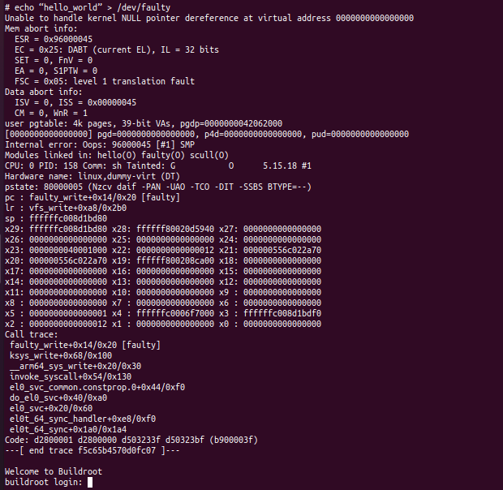

# AESD Assignment 7 faulty-oops write-up

# Description
### Command:
        $ echo “hello_world” > /dev/faulty

### Output:
 

This is called a oops message.

### Analysis:

        Unable to handle kernel NULL pointer dereference at virtual address 0000000000000000

This line tells that the kernel was dereferencing a NULL pointer. This causes a fault and kills all the current tasks and may leak kernel resources. The processor signals a page fault to the OS when dereferencing a invalid pointer.

        CPU: 0 PID: 158 Comm: sh Tainted: G           O      5.15.18 #1

This line tells the core running the process that caused the fault. PID 158 is the process ID of the program that caused the fault. "Tainted: G" indicates that a proprietary module was loaded.

        pc : faulty_write+0x14/0x20 [faulty]

This lines gives information about the function that caused the fault, i.e, faulty_write function and the module containing the function, i.e, faulty.

        lr : vfs_write+0xa8/0x2b0
        sp : ffffffc008d23d80
        x29: ffffffc008d23d80 x28: ffffff80020e0cc0 x27: 0000000000000000
        x26: 0000000000000000 x25: 0000000000000000 x24: 0000000000000000
        x23: 0000000040001000 x22: 0000000000000012 x21: 00000055652b2a50
        x20: 00000055652b2a50 x19: ffffff80020b3100 x18: 0000000000000000
        x17: 0000000000000000 x16: 0000000000000000 x15: 0000000000000000
        x14: 0000000000000000 x13: 0000000000000000 x12: 0000000000000000
        x11: 0000000000000000 x10: 0000000000000000 x9 : 0000000000000000
        x8 : 0000000000000000 x7 : 0000000000000000 x6 : 0000000000000000
        x5 : 0000000000000001 x4 : ffffffc0006f7000 x3 : ffffffc008d23df0
        x2 : 0000000000000012 x1 : 0000000000000000 x0 : 0000000000000000

This section gives information about the link register, stack pointer and other general purpose registers.

        Call trace:
        faulty_write+0x14/0x20 [faulty]
        ksys_write+0x68/0x100
        __arm64_sys_write+0x20/0x30
        invoke_syscall+0x54/0x130
        el0_svc_common.constprop.0+0x44/0xf0
        do_el0_svc+0x40/0xa0
        el0_svc+0x20/0x60
        el0t_64_sync_handler+0xe8/0xf0
        el0t_64_sync+0x1a0/0x1a4
        Code: d2800001 d2800000 d503233f d50323bf (b900003f) 
        ---[ end trace 11881d95acb26246 ]---

Lastly we have the call trace showing the function calls.

### References
https://stackoverflow.com/questions/341422/linux-kernel-programming-unable-to-handle-kernel-null-pointer-dereference#:~:text=It%20means%20the%20kernel%20tried,and%20may%20leak%20kernel%20resources.

https://docs.kernel.org/admin-guide/tainted-kernels.html

https://www.xml.com/ldd/chapter/book/ch04.html